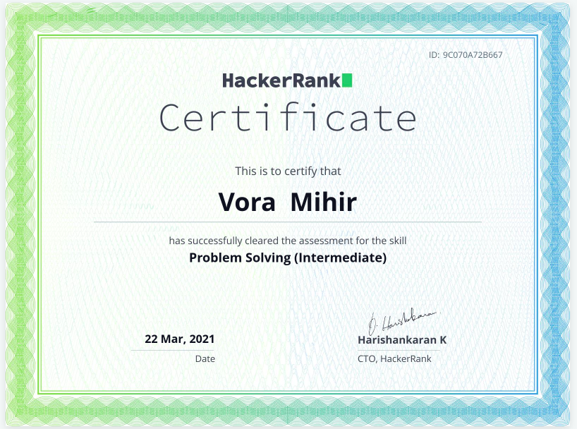

        
         

<h1 align="center">
    <b> 
        Hi !, I’m @voramihir        
    </b>
</h1>

<!--  -->

## Programming languages:

        
        
        
        
        

## Web Technologies:

        
        
        
        

## Frameworks and Libraries:

        
        

## Tools:

        
        
        
        

## Databases        

        
        

## OS:

        
        
        

<!-- for the herokuapp -->
<!--  -->

## Vora Mihir's GitHub Stats:
 

<!-- ###### **SKILLS**
        - Languages:  Python, JavaScript
        - Frameworks/Libraries:  Django, Flask
        - Web Technologies:  HTML5, Bootstrap, CSS(Basic), RESTful API
        - Database Management:  MySQL, SQLite
        - Tools/Platforms:  Git, Github, Ubuntu, VS Code
-->

<!-- 
###### **  [Python HackerRank Badges](https://www.hackerrank.com/mihirvora)**

 --> 

<!--    
[]
 -->

<!-- ## ACHIEVEMENT

|1                                                    |        2                                              |
|-----------------------------------------------------|-------------------------------------------------------|
|        | | -->

## Contact Me:

  
