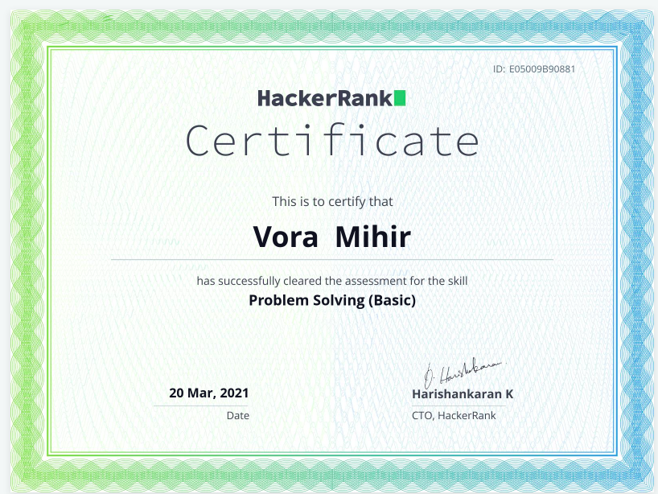

- 👋 Hi, I’m @ervoramihir

# FullStack Developer (Python/Django/Flask/)

###### **  [Python HackerRank Badges](https://www.hackerrank.com/mihirvora)**

## SKILLS
 
  - A FullStack Developer 
  - Problem Solving(Python)
  - Data Structure  and Algorithm
  - Frontend - JavaScript (ofcourse), HTML5
  - Backend - Python, Django, Flask
  - Database - MySQL
  - Dev Tools - Git And Github
  - Data Analytics - Numpy, pandas, Matplotlib
  - Web Scraping - ( Request, Beautiful Soup) etc... 

## ACHIEVEMENT

{:width="10%" height="10%"}  

  
